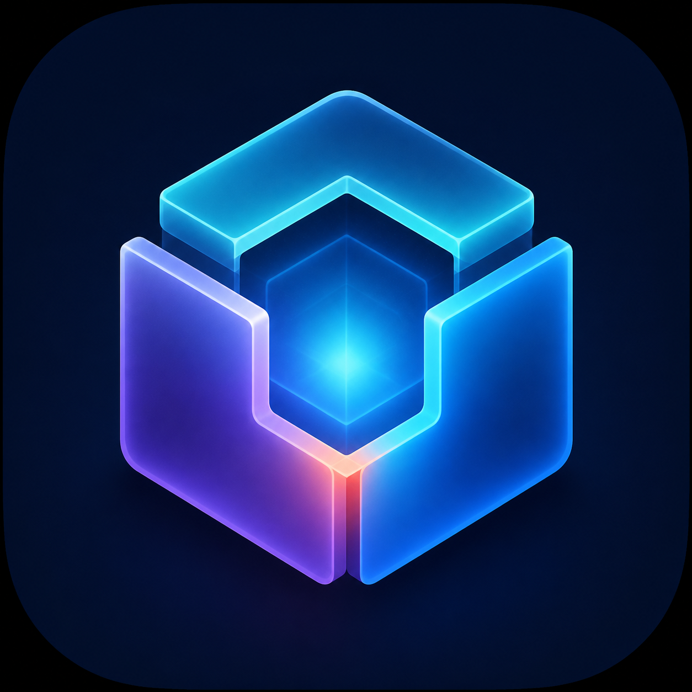

# Lattice VM

<p align="center">
  
</p>

Lattice VM is an independent, open-source virtual machine manager for macOS,
iOS, iPadOS, and visionOS. It is based on
[UTM](https://github.com/utmapp/UTM) and uses QEMU, Apple
Virtualization.framework, and Hypervisor.framework.

> [!IMPORTANT]
> Lattice VM is an early-stage fork. It is not affiliated with or endorsed by
> the UTM project. There are currently no official binary releases.

Current version: **Lattice VM 0.1.0 — Developer Preview**, based on UTM
5.0.3.

## Features

- Run Windows, Linux, macOS, and other operating systems.
- Hardware-accelerated virtualization on supported Apple platforms.
- Full-system emulation across more than 30 processor architectures.
- QEMU and Apple Virtualization backends.
- Built-in macOS 12+ restore-image picker with validated direct Apple CDN
  downloads and automatic installation handoff.
- Windows and Linux release selectors that open official vendor download pages
  and provide architecture-aware ISO import guidance.
- SPICE graphics, terminal mode, USB devices, and shared directories.
- JIT-based QEMU acceleration where the platform permits it.
- A native SwiftUI interface for Apple platforms.

### Modern networking

Lattice VM adds a safer network configuration experience on top of the
QEMU and Apple Virtualization backends:

- Plain-language Shared, Bridged, Host Only, and Emulated VLAN descriptions.
- Live topology summaries showing how each VM reaches the host, LAN, and
  internet.
- One-click Internet Only, Visible on LAN, Development, Isolated Lab, and
  Offline profiles.
- IPv4, IPv6, DHCP, ordered DNS search-domain, and local-domain controls.
- Validation for malformed MAC/IP/CIDR values, invalid DHCP ranges, gateway
  collisions, overlapping rules, and accidental LAN exposure.
- Configuration diagnostics for adapter state, DHCP, detected guest addresses,
  DNS, reachability, and forwarding readiness.
- SSH, HTTP, HTTPS, RDP, and VNC port-forward presets with localhost-only
  defaults and exposure warnings.
- Wi-Fi bridging guidance and explicit explanations of backend limitations.
- A safe expert view of the generated QEMU networking arguments.
- Reusable named host networks for multi-VM development and isolated labs.

The configuration format remains compatible with existing `.utm` virtual
machine bundles. New Lattice VM fields are optional, so older compatible tools
can ignore them. See [Networking](Documentation/Networking.md) for the complete
capability matrix and backend-dependent roadmap.

The current codebase inherits its core functionality from UTM. Lattice VM will
develop its own roadmap, visual identity, documentation, and user experience
while preserving all required upstream attribution.

## Project status

The repository is suitable for development and experimentation. It is not yet
recommended as a replacement for a stable UTM installation. VM data should
always be backed up before testing development builds.

See [ROADMAP.md](ROADMAP.md) for planned work.

### Operating-system installation

- **macOS:** On Apple Silicon, select a macOS 12+ release or import an IPSW.
  Catalog metadata is provided by IPSW Downloads, but the restore image itself
  is accepted only from an Apple-controlled HTTPS host. Downloads are validated
  before Apple's installation service opens them.
- **Windows:** Select Windows 10, Windows 11, or Windows Server guidance, finish
  the download on Microsoft's official page, then import the ISO.
- **Linux:** Select an Ubuntu, Debian, or Fedora source, download an image for
  the configured architecture from the distribution's site, then import it.

Lattice VM does not redistribute operating-system images. Catalog availability
does not guarantee that an older or beta macOS restore image is supported by
the current host.

## Building

Lattice VM cannot build from a source checkout alone. Prebuilt native
dependencies—including QEMU and SPICE—must be staged in the appropriate
`sysroot-*` directories at the repository root.

Start with:

- [macOS development](Documentation/MacDevelopment.md)
- [iOS development](Documentation/iOSDevelopment.md)
- [architecture overview](Documentation/Architecture.md)
- [networking](Documentation/Networking.md)

Open `LatticeVM.xcodeproj` and select the `macOS` scheme for a local Mac build.
Built application products use the Lattice VM name and `org.latticevm.*`
default bundle identifiers. Internal source symbols and the `.utm` package
extension are retained where necessary for source and data compatibility.

Example command-line build:

```sh
xcodebuild -project LatticeVM.xcodeproj \
  -scheme macOS \
  -configuration Debug \
  build
```

## Networking roadmap

The interface intentionally exposes only controls supported by the active
backend. Static DHCP reservations, integrated packet capture, per-VM
firewalling, VPN routing, traffic shaping, recording/replay, and NAT64/DNS64
need a privileged networking service or upstream QEMU/vmnet support. These are
tracked as backend work rather than presented as nonfunctional interface
switches.

Longer-term ideas include a visual multi-VM network designer, declarative
network configuration through the command-line interface, guest service
discovery, expiring service shares, and reusable lab templates.

## Contributing

Contributions are welcome. Read [CONTRIBUTING.md](CONTRIBUTING.md) before
opening an issue or pull request. Please keep changes focused and clearly
identify any behavior inherited from upstream UTM.

Security issues should be reported according to [SECURITY.md](SECURITY.md), not
through a public issue.

## Upstream and attribution

Lattice VM is derived from UTM and retains its Git history, copyright notices,
Apache License 2.0 license, and applicable third-party notices. The upstream
repository is configured locally as `upstream`.

The Lattice VM name and icon are independent fork branding. See
[BRANDING.md](BRANDING.md) and [THIRD_PARTY_NOTICES.md](THIRD_PARTY_NOTICES.md).

## License

The UTM frontend and this fork are distributed under the
[Apache License 2.0](LICENSE). The application also uses components covered by
GPL, LGPL, MIT, BSD, and other licenses. Redistributors are responsible for
satisfying every applicable component license, including source-distribution
and relinking obligations where required.
